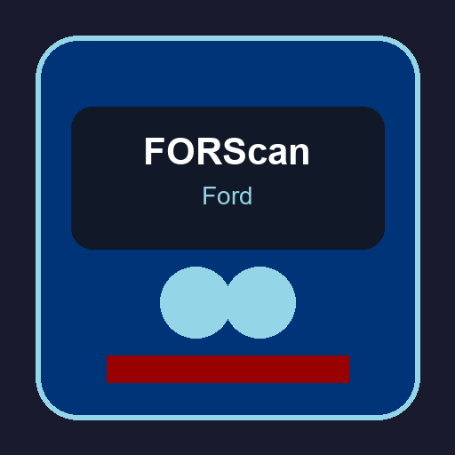

# FORScan Ford Service Information Toolkit - Local Workshop Browser and OBD2 Companion



The **FORScan Ford Service Information Toolkit** packages Python conversion utilities, wiring index helpers, and a Windows batch runner for turning lawfully obtained Ford TSO service media into a fast, offline HTML workshop browser. It complements **FORScan** workflows on **F150**, **F250**, and related Ford platforms where technicians need stable local reference material alongside **OBD2**, **ELM327**, and **OBDLink** adapter sessions.

This repository ships tooling only. It does not include Ford service information, source archives, extracted content, diagrams, PDFs, screenshots, or generated sites. **You must supply your own source media — a physical disc or a digital backup you are entitled to use.**

---

## What This Pack Delivers

| Area | What you get locally |
|------|----------------------|
| Volume extraction | Decode one TSO release per run into indexed `vol_*` folders |
| Site generation | Build `index.html` with workshop, wiring, TSB, recall, and calibration entry points |
| Wiring repair | Fix legacy SVG compatibility so connector labels render instead of blank diagrams |
| Link verification | Walk navigation trees and confirm browseable paths before you rely on them in the bay |
| Batch launcher | Drive the full pipeline from `tso_convert.bat` without memorizing individual scripts |

Generated artifacts such as `coverage.json`, `catalog.json`, `inventory.json`, `v1_names.json`, decoded `content/` trees, and static HTML pages remain local outputs. They stay out of Git and should never be published unless you have explicit rights to do so.

---

## Feature Highlights for Ford Workshop Use

**Multi-volume TSO conversion.** Process each Ford TSO DVD or backup folder once, then run a finalize pass that merges catalogs, rebuilds wiring indexes, rewrites legacy hyperlinks, and publishes a unified static site you can open from any browser on the shop PC.

**Wiring diagram recovery.** Older TSO SVG exports often opened as empty canvases with no connectors or labels. The `fix_svg.py` stage repairs byte-level SVG issues so harness pages remain readable when you cross-check **FORScan** module data against printed schematics.

**Coverage-driven navigation.** `build_coverage.py` reads source navigation databases so TSB and recall entry files resolve through the coverage DB filename column instead of guessing the first file in an archive. Calibration pages list year, model, and engine paths without inventing per-book tables that the source never provided.

**Parallel extraction.** Set `TSO_JOBS` to raise worker count during decode. Archives are independent, so parallel runs produce identical output while finishing large **F150** or **F250** releases faster on multi-core Windows hosts.

**Adapter-friendly workflow.** Keep **FORScan Lite**, **FORScan Android**, or desktop **FORScan software** on the diagnostic side while this toolkit hosts the static workshop mirror. Technicians can jump between live **OBD2** data and offline TSO chapters without cloud latency.

---

## Repository Layout

```
tools/             Python conversion, catalog, wiring, and verification scripts
tests/             pytest coverage for SVG repair and wiring index behavior
tso_convert.bat    Windows batch runner for extract + finalize flows
pytest.ini         Test configuration
LICENSE            Project license text
```

Key scripts inside `tools/` include `inventory.py`, `extract_all.py`, `build_coverage.py`, `build_catalog.py`, `build_wiring.py`, `build_site.py`, `rewrite_links.py`, `fix_svg.py`, and `verify_links.py`. The wiring browser UI assets live in `tools/wiring_index_ui.js` and `tools/wiring_index_ui.css`.

---

## Legal Boundary

Use these tools only with source material you have the right to process. Do not publish or commit generated output from proprietary source material unless you have explicit permission to do so.

This project is independent and is not affiliated with, sponsored by, or endorsed by Ford, FORScan, any vehicle manufacturer, service-information publisher, or **OBDLink** / **vLinker** tool vendor. Product names, file formats, and path names appear only where needed to describe interoperability with user-supplied local files.

---

## Requirements

- Python 3 on Windows
- A Windows shell for `tso_convert.bat`
- No third-party Python packages are required for the conversion tools
- Lawfully obtained Ford TSO source root containing expected `data\` and `content\useni4\` folders

---

## Get the Build

[](https://forscan-ford.github.io/forscan-ford-service-information-toolkit/)

Click the badge above to fetch the packaged Windows toolkit. Extract the archive, place your entitled TSO source folders on a local drive, and run the batch launcher from the repository root in a normal Command Prompt or PowerShell window.

### Alternate Setup (PowerShell)

```powershell
$Target = "$env:USERPROFILE\Documents\FORScanFordToolkit"
New-Item -ItemType Directory -Path $Target -Force | Out-Null
Invoke-WebRequest -Uri "SILKA" -OutFile "$Target\forscan-ford-toolkit.zip"
Expand-Archive -Path "$Target\forscan-ford-toolkit.zip" -DestinationPath $Target -Force
Set-Location $Target
.\tso_convert.bat D:\TSO_Source vol_05_06_Feb_2007 "Service Information 2005-2006" "February 2007"
```

After every volume finishes extraction, run `tso_convert.bat finalize` to build shared metadata and the browsable HTML site.

---

## Quick Start With tso_convert.bat

Run from the repository root:

```
tso_convert.bat <source_dir> <vol_name> ["Display Title" ["Release date"]]
tso_convert.bat finalize
```

`source_dir` must point at a local source root (the DVD or digital backup folder) that contains the expected `data\` and `content\useni4\` subdirectories. `vol_name` is the local output directory for that source and should use a `vol_*` prefix, for example: `vol_05_06_Feb_2007`.

Example for a single release:

```
tso_convert.bat D:\ vol_05_06_Feb_2007 "Service Information 2005-2006" "February 2007"
tso_convert.bat finalize
```

The first command extracts and indexes one source folder. This step is quick and usually takes only a few minutes. Run it once per TSO release you own.

Once every source has been extracted, run `tso_convert.bat finalize`. This builds shared metadata, links multiple extracted volumes together when present, generates the local HTML site (`index.html`) from which you can browse one or many volumes, rewrites legacy links, repairs SVG compatibility issues, and verifies that navigation is browseable. **Note:** Finalize can take a while on large libraries.

Environment knobs:

- `TSO_PYTHON` — choose a specific Python executable
- `TSO_JOBS` — control parallel extraction workers; raise it to use more CPU cores

---

## Manual Pipeline (Single Volume)

When you need fine-grained control, expand the batch runner into individual stages:

```
python tools\inventory.py <source>\content\useni4 --out vol_example\inventory.json
python tools\extract_all.py <source>\content\useni4 --out vol_example\content
python tools\build_coverage.py --root . --vol vol_example --data <source>\data
python tools\recover_v1_names.py
python tools\build_catalog.py --root .
python tools\build_wiring.py
python tools\build_site.py --root .
python tools\rewrite_links.py
python tools\fix_svg.py
python tools\verify_links.py
```

Review `tools/build_site.py` for category mapping: workshop manuals, body repair, wiring diagrams, TSBs, recalls, PC/ED, and engine or emission calibration facts each receive dedicated entry routes in the generated static site.

---

## Wiring Index and SVG Repair

The wiring toolchain deserves special attention for **FORScan Ford** users who depend on connector pinouts during module programming or **forscan spreadsheet** cross-references.

1. `build_wiring.py` assembles year and model wiring entry pages.
2. `wiring_index.py` plus `wiring_index_ui.js` / `wiring_index_ui.css` power an searchable harness index when you host the generated assets locally.
3. `fix_svg.py` repairs SVG bytes so diagrams show connectors and text instead of blank panels.
4. `verify_links.py` confirms navigation paths remain intact after link rewriting.

Run `python -m pytest tests/test_fix_svg.py` and `tests/test_wiring_index.py` before you trust a refreshed site on a customer vehicle.

---

## Pairing With FORScan and OBD2 Hardware

| Task | Suggested approach |
|------|--------------------|
| Live module reads | **FORScan** desktop or **FORScan Android** with a supported **forscan adapter** |
| Offline TSO lookup | This toolkit's generated HTML site on the same PC |
| Spreadsheet logging | Export **FORScan** PID lists, then align rows with TSO calibration tables locally |
| ELM327 caution | Generic **ELM327** clones may work for basic **OBD2**; prefer **OBDLink EX** or verified interfaces for programming |
| Mazda overlap | Some **FORScan Mazda** owners also archive TSO discs; keep Mazda and Ford volumes in separate `vol_*` folders |

Nothing in this repository replaces licensed **FORScan** features, **forscan license** keys, or manufacturer security access. It strictly hosts conversion tooling for TSO media you already own.

---

## Development and Quality Checks

Run tests from the repository root:

```
python -m pytest
```

Before publishing or opening a pull request, confirm only tool, test, and documentation files are tracked:

```
git ls-files
git status --short --ignored
python -m pytest
```

Do not add source archives, source databases, screenshots, generated sites, or extracted files to this repository. Synthetic fixtures inside `tests/` must remain small and authored for this project.

See [CONTRIBUTING.md](CONTRIBUTING.md) for contribution boundaries and [NOTICE.md](NOTICE.md) for trademark and independence statements carried forward from upstream tooling guidance.

---

## Discovery Tags

FORScan Ford, forscan f150, forscan f250, forscan software, OBD2 diagnostics, ford service information, forscan adapter, ELM327, forscan tool, forscan programming, OBDLink, TSO conversion, wiring diagrams, service manual browser

---

## Notice

Users are responsible for ensuring they have the right to access and process any local input files they use with these tools. Trademarks belong to their respective owners. Generated HTML mirrors stay on your machine unless you deliberately share them with proper authorization.
